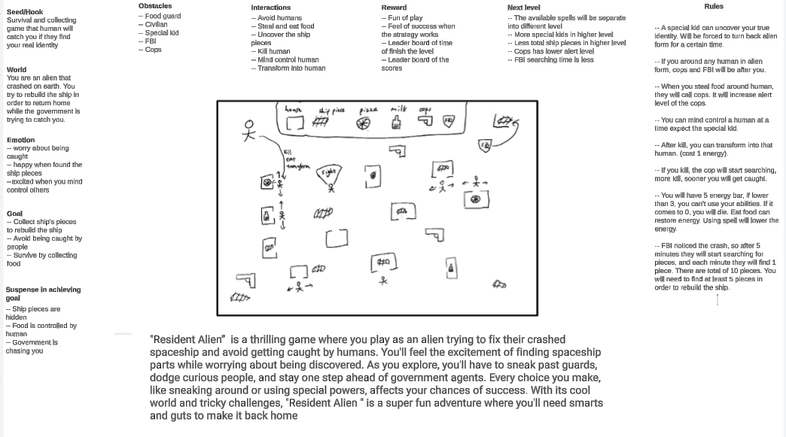

# Resident Alien Game

## Table of contents

* [Motivation](#motivation)
* [Development Process](#development-process)
  * [Phase 1: Brainstorming and Concepts](#phase-1-brainstorming-and-concepts)

## Motivation

## Development Process

### Phase 1: Brainstorming and Concepts

We have brainstormed to come up with this game concept of a 3D thrilling game where you play as an alien trying to 
fix your crashed spaceship and escape from the inspired by the TV show <strong> Resident Alien </strong>. The game will be a third-person game with a focus on exploration 
and puzzle-solving. The game will be set in a large open world with a variety of environments, 
including forests, mountains, and deserts. The game will feature a variety of skills that the player can use to 
fight off enemies and solve puzzles. The game will also feature a variety of enemies, including humans, robots, 
and other aliens. The game will have a strong focus on story and character development, with a variety of side quests 
and other activities for the player to engage in. The game will be developed using the Unity game engine and 
will be released on PC and consoles.

### Phase 2: Prototype

Vedio of the prototype:

<iframe width="560" height="315" src="https://www.youtube.com/watch?v=eVY5dE3e7Jk" frameborder="0" allowfullscreen></iframe>

We have created a prototype of the game to demonstrate the core gameplay mechanics and features.
- Alien: The player controls an alien character who has crash-landed on Earth and is trying to repair his spaceship and escape.
  1. The  red box  represents the alien character in alien form. 
  2. The  blue box  represents the alien character in human form.
- Kid: The kid is represented by the  green box . The kid is a non-playable character who can force the alien to change back to alien form if it's in the human form.
- Civilian: The civilian is represented by the  purple box . The civilian is a non-playable character who can call the police if it sees the food/drink get stolen. Also, the alien can only change into human form after kill a civlian.
- Food/Drink: The food/drink is represented by the food/drink like items. The alien can steal the food/drink to recover health/energy.
- Police: The police is represented by the  yellow box . The police is a non-playable character who will do the following:
  1. If the police sees the alien in alien form, the police will chase and shoot the alien.
  2. If the police sees a dead civilian, it will chase and shoot the alien even if it is in human form.
  3. If the police gets called that food/drink is stolen, it will chase the alien.
- FBI: The FBI is represented by the  orange box . It will collect the ship piece so that the alien may not be able to rebuild the ship and escape.
- Ship Piece: The ship piece is represented by the  grey coin . The alien needs to collect at least 5 of the ship pieces to rebuild the ship and escape.
- Houses: The houses are represented by the brick looking open boxes. The alien can enter the houses to steal food/drink or hide from the police.

## About us

***Hangbo Zhang:*** 

Graduate student in Computer Science at University of Hawaii at Manoa. Graduating in May 2024.

Areas of interest: Software Development, Machine Learning, and Cyber Security.

Email: [hangbo@hawaii.edu](mailto:hangbo@hawaii.edu)

Portfolio: [https://hangbozhang.github.io/](https://hangbozhang.github.io/)

***Feimei Chen:*** 

Graduate student in Computer Science at University of Hawaii at Manoa. Graduating in May 2025.

Areas of interest: Software Development, Machine Learning, and Artificial Intelligence.

Email: [feimei@hawaii.edu](mailto:feimei@hawaii.edu)

Portfolio: [https://feimeichen.github.io/](https://feimeichen.github.io/)

***Mikhail Shkaralevich:*** 

Undergraduate student in BS Computer Science at University of Hawaii at Manoa. Expect to graduate in Fall 2025.

Areas of interest: Software & Web Developmen, Robotics and Cybersecurity.

Email: [mikhail8@hawaii.edu](mailto:mikhail8@hawaii.edu)

Portfolio: [https://mikhail-shkaralevich.github.io/](https://mikhail-shkaralevich.github.io/)
